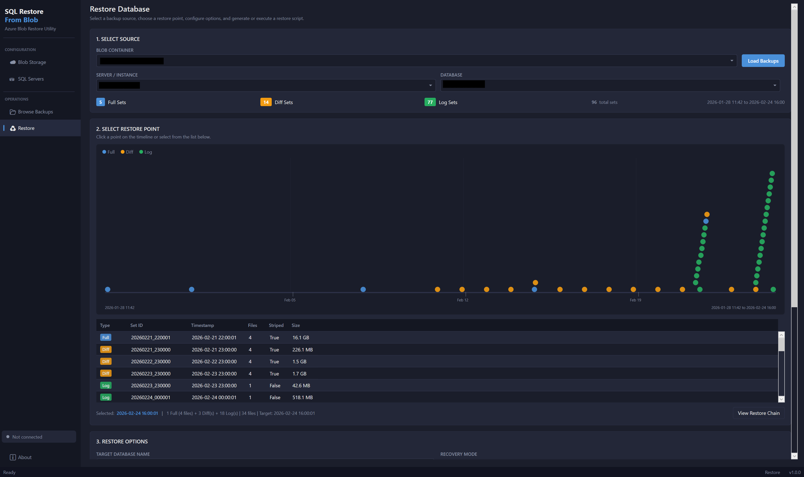
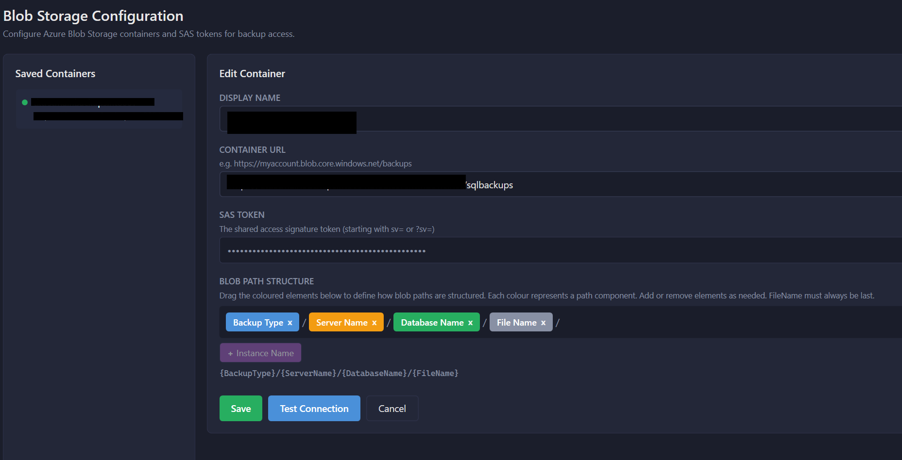
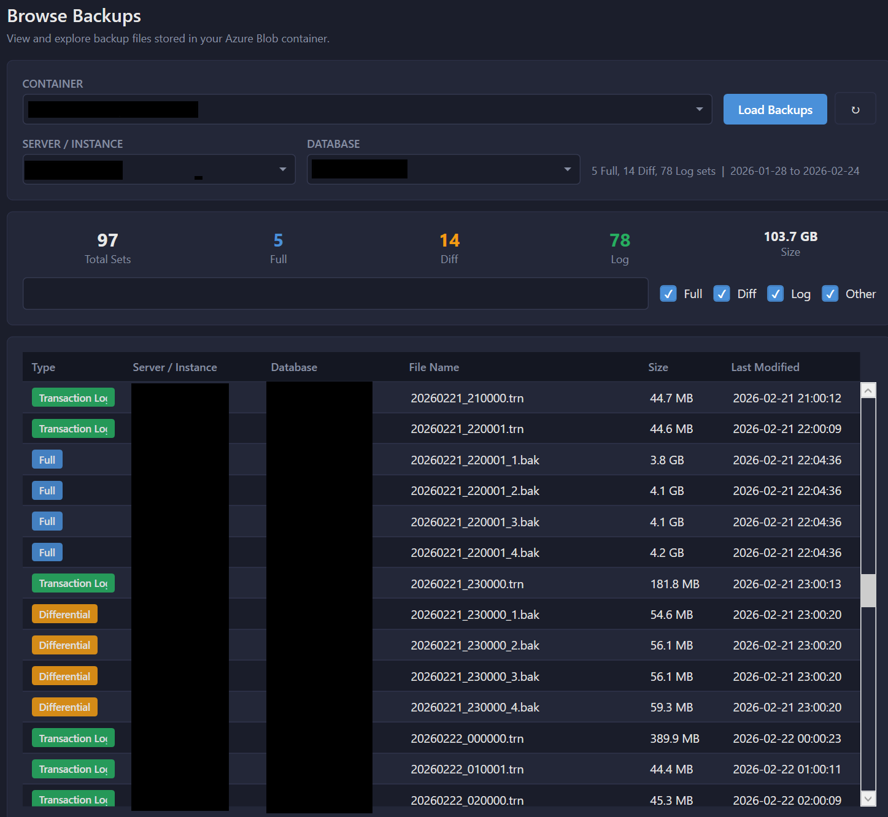
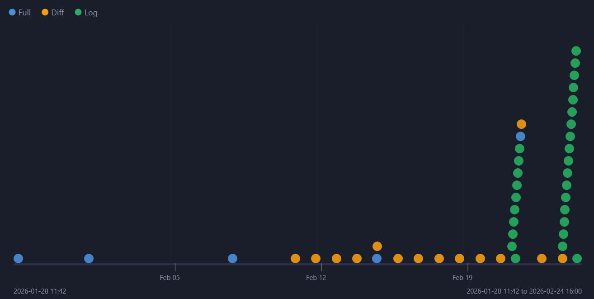
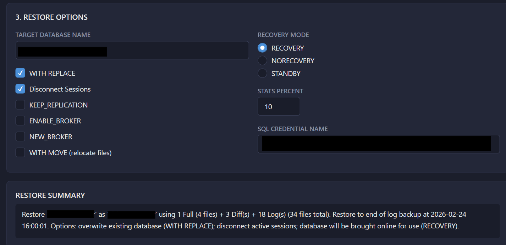
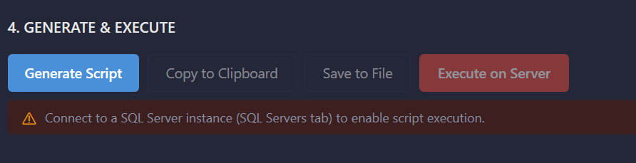

# SQL Restore From Blob

A sleek, modern Windows desktop application for restoring SQL Server databases from Azure Blob Storage backups. Built with WPF on .NET 8, featuring a dark-mode UI, intelligent backup chain detection, point-in-time recovery, and secure credential management.



## Features

### Azure Blob Storage Integration
- Connect to Azure Blob Storage containers using SAS tokens
- Automatic discovery of backup files (Full, Differential, Transaction Log)
- Intelligent parsing of blob path structures with customisable patterns
- Support for striped backup sets (multiple files per backup)
- Secure SAS token storage using Windows Credential Manager

### SQL Server Connectivity
- Windows Authentication and SQL Server Authentication support
- Configurable connection options (Encrypt, Trust Server Certificate, Timeout)
- Persistent server configurations with secure password storage
- Real-time connection status visible across all views

### Backup Discovery & Browsing
- Browse all backups in a container with filtering by server, database, and type
- Automatic inference of database names from folder structures
- Configurable path pattern builder with drag-and-drop components
- Summary statistics showing backup set counts (not just file counts)

### Point-in-Time Recovery
- Visual timeline showing all available restore points
- Colour-coded dots for Full (blue), Differential (orange), and Log (green) backups
- Clickable restore points with automatic chain calculation
- Intelligent backup chain building including all required differentials

### Restore Script Generation
- Complete T-SQL restore scripts with proper `FROM URL` syntax
- **No SAS token or credential in scripts** – the generated script never contains credentials; the SQL Server must already have a credential for the blob container URL (or you create it from the app)
- Restore options show whether the blob credential exists on the connected server; optional "Create credential on server" so you can create/update it without putting the token in any script
- Support for all common restore options:
  - `WITH REPLACE` - Overwrite existing database
  - `WITH MOVE` - Relocate data/log files (auto-detects server default paths)
  - Recovery modes: `RECOVERY`, `NORECOVERY`, `STANDBY`
  - `KEEP_REPLICATION`, `ENABLE_BROKER`, `NEW_BROKER`
  - Configurable `STATS` percentage
- Disconnect sessions option (`SET SINGLE_USER WITH ROLLBACK IMMEDIATE`)

### Direct Execution
- Execute restore scripts directly against connected SQL Server instances
- Real-time progress logging with auto-scroll
- Safe "arm-to-execute" confirmation (no modal dialogs)
- Full restore chain execution with progress feedback

## Screenshots

### Blob Storage Configuration


*Configure Azure Blob Storage containers with SAS tokens. Drag-and-drop path pattern builder for custom folder structures.*

### Browse Backups


*Browse all backups with filtering by server, database, and backup type. Summary shows set counts accounting for striped backups.*

### Restore Timeline


*Visual timeline with clickable restore points. Select any point to see the complete restore chain required.*

### Restore Options


*Configure restore options including WITH MOVE with auto-detected server paths, recovery mode, and more.*

### Script Generation & Execution


*Generate restore scripts or execute directly with real-time progress logging.*

## Installation

### Download Release

Download the latest release from the [Releases page](https://github.com/jakemorgangit/SQLRestoreFromBlob/releases).

The application is distributed as a single self-contained executable (`SQLRestoreFromBlob.exe`) - no installation required. Simply download and run.

**Requirements:**
- Windows 10/11 (x64)
- No .NET runtime installation required (self-contained)

### Build from Source

#### Prerequisites
- [.NET 8 SDK](https://dotnet.microsoft.com/download/dotnet/8.0) or later
- Windows 10/11 (WPF application)

#### Clone and Build

```bash
git clone https://github.com/jakemorgangit/SQLRestoreFromBlob.git
cd SQLRestoreFromBlob
dotnet build
```

#### Run in Development

```bash
dotnet run --project src/SQLRestoreFromBlob
```

#### Publish Single-File Executable

```bash
dotnet publish src/SQLRestoreFromBlob -c Release -r win-x64 --self-contained true -p:PublishSingleFile=true -p:IncludeNativeLibrariesForSelfExtract=true -o ./publish
```

The executable will be created at `./publish/SQLRestoreFromBlob.exe`.

## Usage Guide

### 1. Configure Blob Storage

1. Navigate to **Blob Storage** in the sidebar
2. Click **+ Add Container**
3. Enter a display name for the container
4. Enter the full container URL (e.g., `https://mystorageaccount.blob.core.windows.net/sqlbackups`)
5. Enter your SAS token (with at least `list` and `read` permissions)
6. Configure the **Blob Path Structure** to match your backup folder layout:
   - Default: `{BackupType}/{ServerName}/{DatabaseName}/{FileName}`
   - Drag and drop components to rearrange
   - Add `{InstanceName}` if your paths include SQL instance names
7. Click **Test Connection** to verify access
8. Click **Save**

### 2. Configure SQL Server (Optional - for direct execution)

1. Navigate to **SQL Servers** in the sidebar
2. Click **+ Add Server**
3. Enter server details and authentication method
4. Configure encryption and certificate options as needed
5. Click **Test Connection** to verify
6. Click **Save**
7. Select the server and click **Connect** to establish a session

### 3. Browse Backups

1. Navigate to **Browse Backups** in the sidebar
2. Select your configured container from the dropdown
3. Click **Load Backups**
4. Use filters to narrow down by server, database, or backup type
5. Review the summary showing backup set counts

### 4. Restore a Database

1. Navigate to **Restore** in the sidebar
2. Select your container and click **Load Backups**
3. Filter by server/database if needed
4. Click a restore point on the timeline (or in the list)
5. Review the restore chain in the details panel
6. Configure restore options:
   - **Target Database Name** - Name for the restored database
   - **WITH REPLACE** - Overwrite if database exists
   - **WITH MOVE** - Relocate files (paths auto-detected from connected server)
   - **Recovery Mode** - RECOVERY (online), NORECOVERY (for more restores), or STANDBY
7. Click **Generate Script** to create the T-SQL
8. Either:
   - **Copy to Clipboard** or **Save to File** to run manually in SSMS
   - **Execute on Server** to run directly (requires connected SQL Server)

### 5. Execute Restore

When clicking **Execute on Server**:
1. The button changes to "Confirm Execute (5)" with a countdown
2. A warning banner appears showing the target server and database
3. Click the button again within 5 seconds to confirm
4. Watch the real-time execution log for progress
5. Upon completion, the database is restored and online (if RECOVERY mode selected)

## SAS Token Requirements

Your SAS token needs the following minimum permissions:
- **List (l)** - To enumerate blobs in the container
- **Read (r)** - To read backup files

For restore execution, the SQL Server instance must have a credential for the blob container URL (identity `SHARED ACCESS SIGNATURE`). You can create or update this credential from the app using "Create credential on server" in the Restore options; the SAS token is never included in generated scripts.

Example SAS token permissions: `sp=rl` (read + list)

Recommended: `sp=racwdl` (read, add, create, write, delete, list) for full functionality.

## Backup Folder Structure

The application parses backup file paths to infer metadata. Configure the path pattern to match your structure.

### Default Pattern
```
{BackupType}/{ServerName}/{DatabaseName}/{FileName}
```

Example paths:
```
FULL/SQLSERVER01/AdventureWorks/20240115_220000_1.bak
DIFF/SQLSERVER01/AdventureWorks/20240116_060000_1.bak
LOG/SQLSERVER01/AdventureWorks/20240116_070000.trn
```

### With Instance Name
```
{BackupType}/{ServerName}/{InstanceName}/{DatabaseName}/{FileName}
```

Example:
```
FULL/SQLSERVER01/MSSQLSERVER/AdventureWorks/20240115_220000.bak
```

### Striped Backups

The application automatically detects striped backup sets by filename pattern:
```
20240115_220000_1.bak
20240115_220000_2.bak
20240115_220000_3.bak
20240115_220000_4.bak
```

These are grouped as a single backup set with 4 files.

## Restore Chain Logic

The application builds complete restore chains automatically:

1. **Full Backup** - Always required as the base
2. **Differential Backups** - All differentials since the last full (incremental chain)
3. **Transaction Logs** - All logs after the last differential (or full if no diffs)

When you select a transaction log restore point, the chain includes:
- The most recent full backup before that log
- All differential backups between the full and the log
- All transaction logs from the last differential to your selected point

## Security

### Credential Storage

- **SAS Tokens** - Stored securely in Windows Credential Manager
- **SQL Passwords** - Stored securely in Windows Credential Manager
- **Configuration** - Non-sensitive settings stored in `%LOCALAPPDATA%\SQLRestoreFromBlob\config.json`

### SAS Token Handling

- **After save, the token is never shown again** – once a SAS token is saved for a container, it cannot be viewed in the UI; you can only replace it by entering a new token. This reduces the risk of exposure.
- For new containers (before save), you can type the token and optionally show/hide it while editing.

## Architecture

Built with:
- **.NET 8** (LTS) - Windows Presentation Foundation (WPF)
- **CommunityToolkit.Mvvm** - MVVM pattern implementation
- **Azure.Storage.Blobs** - Azure Blob Storage SDK
- **Microsoft.Data.SqlClient** - SQL Server connectivity

### Project Structure
```
SQLRestoreFromBlob/
├── src/
│   └── SQLRestoreFromBlob/
│       ├── Assets/              # Application icon
│       ├── Converters/          # XAML value converters
│       ├── Models/              # Data models
│       ├── Services/            # Business logic services
│       ├── Themes/              # Dark theme resources
│       ├── ViewModels/          # MVVM ViewModels
│       └── Views/               # XAML views
├── publish/                     # Published executable
└── SQLRestoreFromBlob.sln       # Solution file
```

## Known Limitations

- Windows only (WPF application)
- x64 architecture only
- SAS token authentication only (no Azure AD/Managed Identity yet)
- Single container per restore operation
- No differential backup "skip" - all diffs in range are restored

## Troubleshooting

### "AuthorizationFailure" when connecting to blob storage
- Verify your SAS token has `list` permission
- Check the token hasn't expired
- Ensure the container URL is correct (no trailing slash)

### "File cannot be restored to..." error
- Enable **WITH MOVE** option
- Connect to SQL Server first to auto-detect default paths
- Manually specify data/log file paths

### Database left in "RESTORING" state
- This is expected if you selected **NORECOVERY** mode
- Run `RESTORE DATABASE [YourDB] WITH RECOVERY` to bring it online

### "Incorrect syntax near '@secret'"
- Fixed in v1.0 - update to the latest release

## Contributing

Contributions are welcome! Please:
1. Fork the repository
2. Create a feature branch
3. Submit a pull request

## License

This project is licensed under the MIT License - see the [LICENSE](LICENSE) file for details.

## Author

**Jake Morgan** - [Blackcat Data Solutions Ltd](https://blackcat.wales)

## Acknowledgements

- UI design inspired by [Erik Darling's SQL Performance tools](https://www.erikdarling.com/)
- Built with [CommunityToolkit.Mvvm](https://github.com/CommunityToolkit/dotnet)
